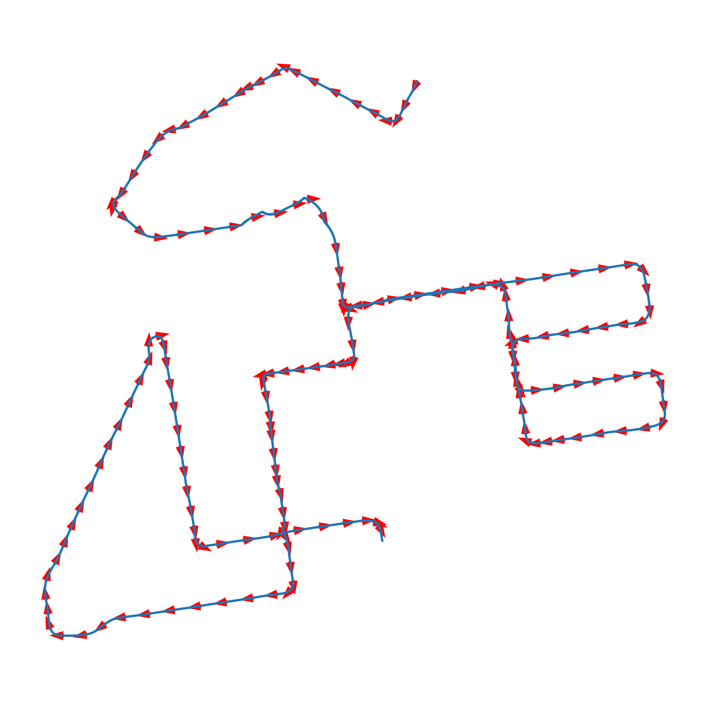

# Deep Learning Approach to Global Bird's Eye View Semantic Mapping

# Setup
1. Clone the repo
2. Download the AI-IMU dataset and store in root directory.
3. Download the local BEV data 
4. Store `MotionNet_Prediction` and `MotionNet_Prediction_Test` folders from the data in root directory.
5. Create `temp` and `results` folder under root directory.
6. Run `python3 kitti_mapping_opt.py`
7. If you want to run `main_KITTI.py`, please call it under root directory, and run `python3 ai_imu_dr/src/main_kitti.py`

# Results

    
    
    
    

    
    
    
    

    
    
    
    

## Poster

The poster can be found at `media/poster.pdf`.

## Presentation Video
